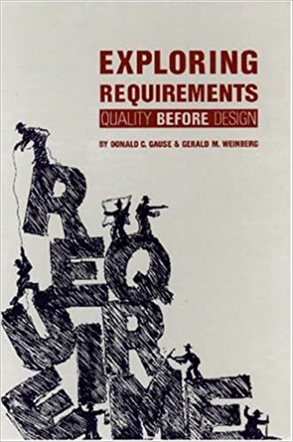

Improve your skills at discovering, defining, and distilling requirements. Download the [Exploring Requirements Book Club Guide](./exploring-requirements-book-club.pdf) and sign up below to join. You will receive information about how to join the video conference after you sign up.

The first meeting will occur on April 1, 2021 at 8:00AM Pacific Time.

<iframe src="https://docs.google.com/forms/d/e/1FAIpQLSdOzhhzKSN5hhRl8Q1QA92KBTAOF2s6G7bZpCSlqdfrBk6GkA/viewform?embedded=true" width="640" height="1278" frameborder="0" marginheight="0" marginwidth="0">Loading…</iframe>

